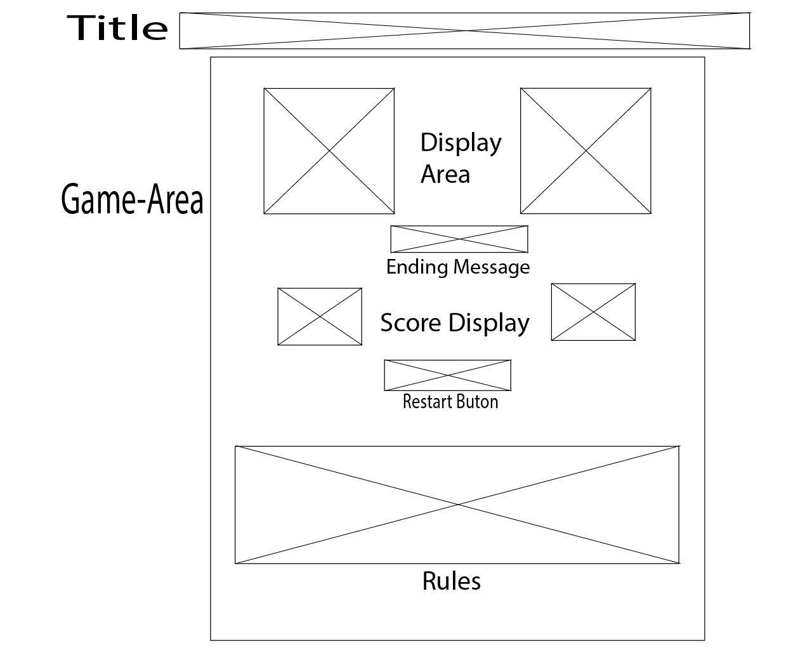
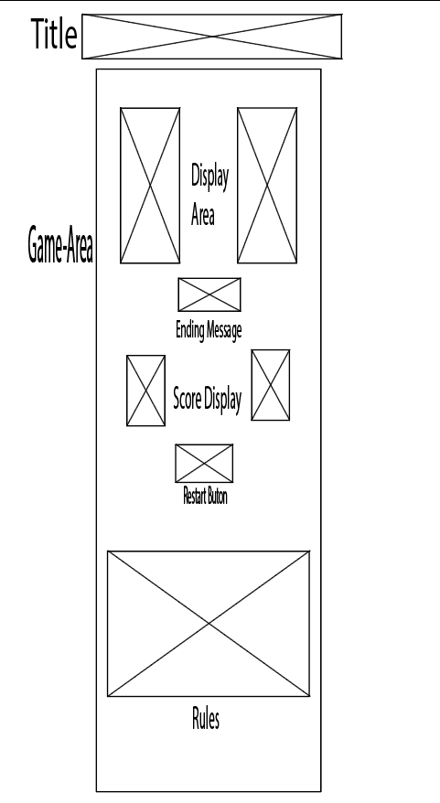

# **_Rock, Paper, Scissor, Lizard, Spock_**

This game is an extention of the standard Rock, Paper Scissor game with a twist. This expanded version with Lizard & Spock in the mix makes things intresting. This version of the game was first seen on TV on the popular show The Big Bang Theory, when sheldon played this game against his friend Raj to decide what show they will watch.

# Contents

* [**User Experience UX**](<#user-experience-ux>)
    * [Wireframes](<#wireframes>)
    * [Site Structure](<#site-structure>)
    * [Design Choices](<#design-choices>)
    *  [Typography](<#typography>)
    *  [Colour Scheme](<#colour-scheme>)
* [**Features**](<#features>)
    * [Existing Features](<#existing-features>)
      * [5 Playable Options](<#5-playable-options>)
      * [Score-Moves-Restart](<#score-Moves-restart>)
* [**Testing**](<#testing>)
* [**Deployment**](<#deployment>)
* [**Credits**](<#credits>)
    * [**Content**](<#content>)
    * [**Media**](<#media>)
*  [**Acknowledgements**](<#acknowledgements>)

# User Experience (UX)

# Wireframes

The wireframes for the game Rock, Paper, Scissor, Lizard, Spock were produced in Adobe Illistrator. The frames showcase a full width display and for small mobile devices.

**Desktop Wireframes Starting Screen and Ending Screen**

**Mobile Wireframes Starting Screen and Ending Screen**

# Site Structure 

The games website consists of 1 interactive page to play a game of rock, paper, scissor, lizard, spock with 10 moves to decide a winner with the highest score. If the scores are equel the game will end in a Tie. Once the game has ended the restart button can reload the game to play again or if things arent going your way you can hit the restart button before the game ends.

[Back to top](<#contents>)

## Design Choices

* ### Typography
    The fonts chosen were 'Noto Sans Avestan' for the body and 'Noto Serif Georgian' to fall back to respectively. 
    * These fonts were chosen to compliment the look of the game area while giving a strong bold heading appearance.

 * ### Colour Scheme
    * The colour scheme eventually chosen is based on a White background, with a game card background that is a mix of Magenta, Yellow and Black, with the main text colour of black and a range of colours for the options in the game to give a pleasent contrast between the different colours. 

[Back to top](<#contents>)

# Features

This Rock Paper Scissor Lizard Spock game is set up to give the player a fun experience of an old game they would have liked to play when seeing it on TV.

## Existing Features  
  * ### 5 Playable Options

    5 playable options are in the game, 2 more than the standard Rock, Paper, Scissor game bringing the total number of possible outcomes from (27 combinations) to (199 combinations). With many more posible outcomes, come many more enjoyable moments.

    As a fan of the TV show you may be excited to play the game but remembering back when sheldon explained the rules he may of been a bit too fast so if you need some help the rules of the game they are clearly explained below the restart button. There is also a default image displayed before the player makes a choice to help explain the rules.

[Back to top](<#contents>)

  * ### Moves Left
    * The moves left tracker lets the player know how many rounds are left, decreacing after every round until 0. Once the game has ended, the end screen will display the end result while letting the player know if they have either won, lost or drew the game.

  * ### Score Tracker
    While playing the game,:
    * Each round won will award you a point.
    * Each round lost will award the computer a point.
    * No points are awarded when a round ends in a draw.

  * ### Restart Button
    The restart button is displayed below the score tracker to give the user an option to restart the game at any point reloading the game to the start.

[Back to top](<#contents>)

## Future Features 
  * Add computer vs computer option to the game.
  * Change display of points to show case the number of Ties in each game.
  * Button to give player the choice of showing/hiding the rules to inhance user experience.
  * Add icons to 5 playable options with text displayed below.

[Back to top](<#contents>)

# Testing

Please refer to [**_here_**](Testing.md) for more information on testing Rock, Paper, Scissor, Lizard, Spock Game.

[Back to top](<#contents>)

# Deployment

### **To deploy the project**
The site was deployed to GitHub pages. The steps to deploy the site are as follows:
  1. In the GitHub repository, navigate to the **Project**.
  2. In the GitHub project, navigate to the **Settings** tab.
  3. Once in Settings, navigate to the **Pages** tab on the left hand side.
  4. Under **Source**, select the branch to **Deploy from a branch**.
  5. Under **Branch** select **Main** then click **save**.
  6. Once the master branch has been selected, then refresh the page to see your link with a check mark.

The live link to the Github repository can be found here -https://s-shah93.github.io/Project-2-JavaScript-Rock-Paper-Scissors-Lizard-Spock-Game/

### **To fork the repository on GitHub**
A copy of the GitHub Repository can be made by forking the GitHub account. This copy can be viewed and changes can be made to the copy without affecting the original repository. Take the following steps to fork the repository;
1. Log in to **GitHub** and locate the [repository](https://github.com/S-shah93/Project-2-JavaScript-Rock-Paper-Scissors-Lizard-Spock-Game).
2. On the right hand side of the page inline with the repository name is a button called **'Fork'**, click on the button to create a copy of the original repository in your GitHub Account.

### **To create a local clone of this project**
The method from cloning a project from GitHub is below:

1. Under the repository’s name, click on the **code** tab.
2. In the **Clone with HTTPS** section, click on the clipboard icon to copy the given URL.

3. In your IDE of choice, open **Git Bash**.
4. Change the current working directory to the location where you want the cloned directory to be made.
5. Type **git clone**, and then paste the URL copied from GitHub.
6. Press **enter** and the local clone will be created.

[Back to top](<#contents>)

# Credits
### Content

* The font came from [Google Fonts](https://fonts.google.com/).
* The colour palate was compiled by [Colormind](http://colormind.io/).
* [Adobe Illistrator](https://www.adobe.com/ie/products/illustrator.html) was used to create the wireframes.
* To get a better understanding of how to start writing the functions for the game I found great advice from 2 specfic YouTubers [Code with Ania Kubów](https://www.youtube.com/watch?v=RwFeg0cEZvQ&t=1031s) & [Web Dev Simplified](https://www.youtube.com/watch?v=7UMuJMiNjSk&t=366s).
* In addition many blogs from [GeeksforGeeks](https://www.geeksforgeeks.org/), [W3Schools](https://www.w3schools.com/) and [Youtube](https://www.youtube.com/) videos were researched in regards to CSS styling & JavaScript functions.

### Media
* The options images displayed came from [Font Awesome](https://fontawesome.com/) in the form of an SVG file.

* The default image was found on google [Google Images](https://www.google.com/search?q=rock+paper+scissors+lizard+spock+researchgate&tbm=isch&ved=2ahUKEwjU0bHYrYj6AhUKJMAKHUY7B3kQ2-cCegQIABAA&oq=rock+paper+scissors+lizard+spock+researchgate&gs_lcp=CgNpbWcQAzoECAAQQzoFCAAQgAQ6BAgAEBhQoQJYshVgtBZoAHAAeACAATSIAeAEkgECMTSYAQCgAQGqAQtnd3Mtd2l6LWltZ8ABAQ&sclient=img&ei=NIgbY9TnA4rIgAbG9pzIBw&bih=880&biw=1920#imgrc=dH84YqPOTNSiBM)

[Back to top](<#contents>)

# Acknowledgements
The site was completed as a Portfolio 2 Project piece for the Full Stack Software Developer Diploma at the [Code Institute](https://codeinstitute.net/). As such I would like to thank my mentor [Precious Ijege](https://www.linkedin.com/in/precious-ijege-908a00168/), the Slack community, and all at the Code Institute for their help and support. The Rock, Paper, Scissor, Lizard, Spock game was designed to give the player a little reminder of a game they may have forgotten.

[Back to top](<#contents>)